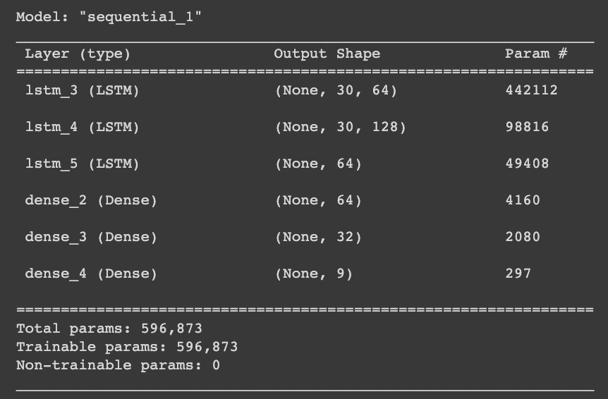

# 🤔 Problem

70 millions people in the world are considered functionally deaf.
The vast majority of health practicioners do not speak sign languages. Communications with deaf patients is a struggle.

 
 

# 💡 Solution

Sign language detector for medical practitioner to help them understand symptoms from hearing-impaired patients.
Our model is trained on the most common symptoms that doctors and nurses may face on a daily basis.

We use American Sign Language (ASL) for this project but the code can be reused to train on any form of sign language.

 
 

# 🤖 Stack overview

**Open CV**: to work easily with our webcam to generat our dataset

**Mediapipe**: Google library to extract keypoints from a human body in real time

**Tensorflow**: for building and training our models

**Tensorflow JS**: for converting to layer model or graph model and use in a JavaScript application

**Numpy**: classic for dealing with data extraction and pre-processing

 
 

# 🪜 Project steps

## 1. 💽 Data collection

We first considered a large-scale dataset for Word-Level American Sign Language: https://github.com/dxli94/WLASL - but since we used a reduced scope of 9 words to translate for this project, we generated our own dataset with our own videos.

We have collected 30 videos of 30 frames for each word. It means in total our model will be trained on 9 * 30 * 30 👉 **81.000 frames**

 

## 2. 💽 Data preprocessing

We've saved each frame of each video as a numpy array of size (,1662). It means that for each frame, there is a total of **1662 keypoint values**.

We use a 10% test split which means we end up with

💡 Tip: if using Google Colab for training, you must zip and unzip the data before in order to allow for 10x faster processing with Numpy.

 

## 3. ⏳ Training an LSTM neural network

We used a variety of architectures for the LSTM neural network. The one that yielded the best results was the following:

3 LSTM layers followed by 2 dense layers before the output layer.

Considering we had a small dataset to train on (30 videos for each class).

 

## 4. 🧠 Training a CNN + LSTM neural network

Many research papers working on sign languages seem to support that state-of-the-art models use a combination of CNN layers followed by a number of LSTM layers.

The issues with this architecture are:

1. It requires a much larger volume of data to train on (as is typically the case with large neural networks). Considering we generated our own dataset and only had 30 videos per class - our model performed quite poorly in real life.
2. It would result in a much denser neural network (20m+ parameters) which meant much longer training time
3. A much complex network means inference would take longer once converted to Tensorflow JS - which is a matter of concern for us since we are trying to make detections in real-time on a video feed.

 

## 5. 📽 Evaluation and test in real time

Both LSTM and CNN+LSTM models provided good categorical accuracy (95%+) but when tested in real time, the LSTM performed better and seem to

We logged metrics from our model and displayed them in Tensorboard. Scripts are available in the notebook in order to test your model in real-time using your webcam before diving into the production side.

 

## 6. 🚲 Lifecycle setup

We use Weights & Biases to keep track of our training metrics. We dump the Tensorflow files after training using the WandB API and display the Tensorboard dashboards.

 

## 7. 🌟 Convert model to Tensorflow JS

Depending on the type of model built, we converted our .h5 Keras model to a layers model or graph model.

LSTM 👉 layers model

CNN + LSTM 👉 graph model

 
